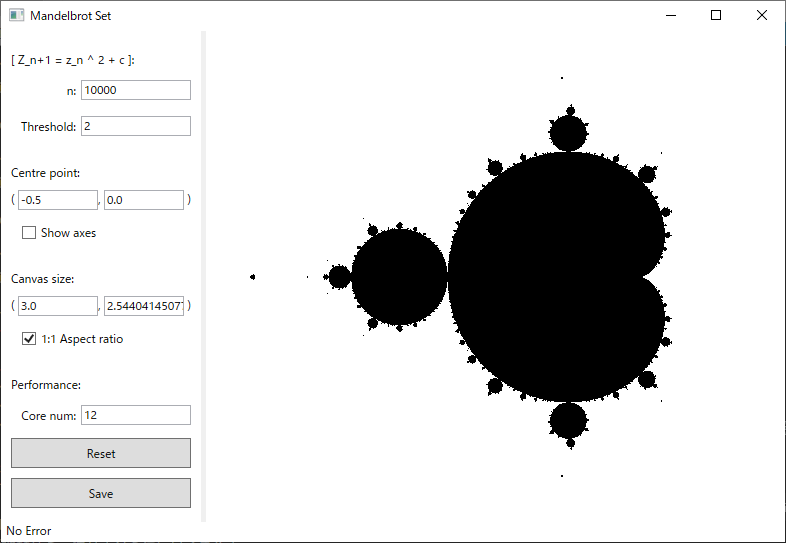

# MandelbrotSet
This application displays the mandelbrot set.  

## Usage
The application has the following parameters and buttons:  

### Parameters
* **n**
How many times to calculates the sequence.  
* **Threshold**
The app regards that the following sequence diverges  
$$ f(z)=z^2+c, f(0) = 0 $$
* **Centre point**
This point (x, y) represents a point on the complex plane at the centre of the canvas.  
The default value is (-0.5, 0.0).  
* **Show aces**
If this check box is ticked, x and y axes are displayed.  
Not ticked as default.  
* **Canvas size**
This size (w, h) is the size of the complex plane.  
* **1:1 Aspect ratio**
If this check box is ticked, the height is determined automatically by modifying width. vice versa.  
The ratio is determined by the actual canvas size.  
* **Core num**
The app calculates the sequence asynchronously based on this number.  
You should keep this not less than the CPU core number.  
### Buttons
* **Reset**
By pressing this button, you can reset the parameters X, Y, H, W and '1:1 Aspect ratio' and repaint the canvas.  
* **Save**
By pressing this button, you can save the current image to the current directory.  

### Canvas
* **Zoom**
You can zoom it in (x5) by wheel up the middle button on the mouse and zoom it out (x0.2) by wheel down the same button.  
You also can zoom the canvas in by drag and drag with the left button on the mouse like the following image.  

* **Move**
You can move the centre point by clicking right button on the mouse.  
